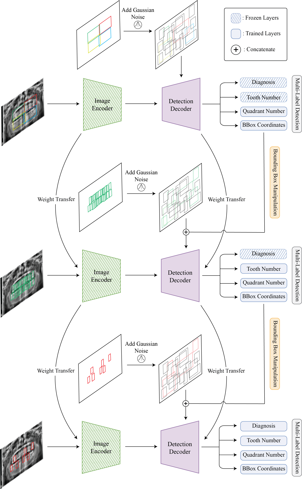
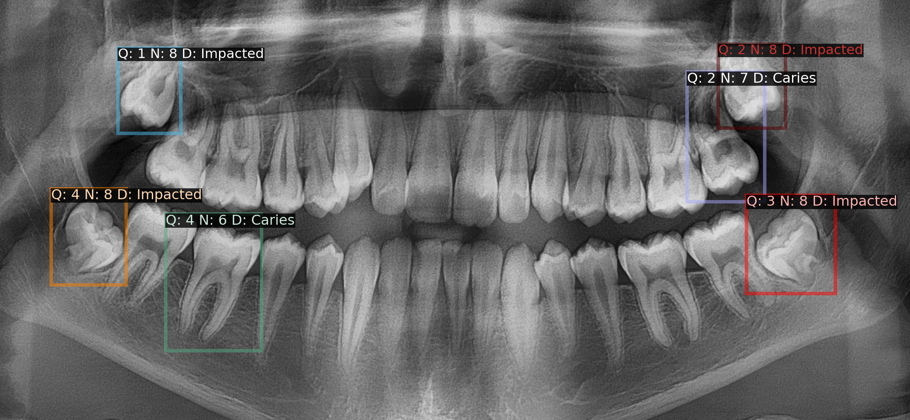

# HierarchicalDet: Diffusion-Based Hierarchical Multi-Label Object Detection to Analyze Panoramic Dental X-rays
This repository contains the code that underpins the innovative research presented in the MICCAI 2023 paper *[Diffusion-Based Hierarchical Multi-Label Object Detection to Analyze Panoramic Dental X-rays](https://arxiv.org/abs/2303.06500)*. Ibrahim Ethem Hamamci, Sezgin Er, Enis Simsar, Anjany Sekuboyina, Mustafa Gundogar, Bernd Stadlinger, Albert Mehl, Bjoern Menze.

<details><summary>Table of Contents</summary><p>
  
* [Our Framework](#Our-Framework)
* [Output of the Model](#Output-of-the-Model)
* [What is Our Approach?](#what-is-our-approach)
* [Citing Us](#citing-us)
* [Data](#data)
* [License](#license)
* [Contact](#contact)
  
</p></details><p></p>

## Our Framework

*Our Diffusion-Based Object Detection method relies on a hierarchical learning approach utilizing a combination of multi-label detection, bounding box manipulation and weight transfer.*
## Output of the Model

*Output from our final model showing well-defined boxes for diseased teeth with corresponding quadrant (Q), enumeration (N), and diagnosis (D) labels.*

## What is Our Approach?
Although numerous ML models have been developed for the interpretation of panoramic X-rays, there has not been an end-to-end model developed that can identify problematic teeth with dental enumeration and associated diagnoses at the same time. To develop such a model, we structure the three distinct types of annotated data hierarchically following the FDI system, the first labeled with only quadrant, the second labeled with quadrant-enumeration, and the third fully labeled with quadrant-enumeration-diagnosis. To learn from all three hierarchies jointly, we introduce a novel diffusion-based hierarchical multi-label object detection framework by adapting DiffusionDet that formulates object detection as a denoising diffusion process from noisy boxes to object boxes.

Specifically, to take advantage of the hierarchically annotated data, our method utilizes a novel noisy box manipulation technique by adapting the denoising process in the diffusion network with the inference from the previously trained model in hierarchical order. We also utilize a multi-label object detection method to learn efficiently from partial annotations and to give all the needed information about each abnormal tooth for treatment planning. Experimental results show that our method significantly outperforms state-of-the-art object detection methods, including RetinaNet, Faster R-CNN, DETR, and DiffusionDet for the analysis of panoramic X-rays, demonstrating the great potential of our method for hierarchically and partially annotated datasets.

*Also, our work serves as a baseline method for [DENTEX (Dental Enumeration and Diagnosis on Panoramic X- rays Challenge)](https://dentex.grand-challenge.org/) which will be held at MICCAI 2023.*

## Citing Us

If you use HierarchicalDet, we would appreciate references to the following papers. 

```
1. @article{hamamci2023diffusion,
  title={Diffusion-Based Hierarchical Multi-Label Object Detection to Analyze Panoramic Dental X-rays},
  author={Hamamci, Ibrahim Ethem and Er, Sezgin and Simsar, Enis and Sekuboyina, Anjany and Gundogar, Mustafa and Stadlinger, Bernd and Mehl, Albert and Menze, Bjoern},
  journal={arXiv preprint arXiv:2303.06500},
  year={2023}
}


2. @article{hamamci2023dentex,
  title={DENTEX: An Abnormal Tooth Detection with Dental Enumeration and Diagnosis Benchmark for Panoramic X-rays},
  author={Hamamci, Ibrahim Ethem and Er, Sezgin and Simsar, Enis and Yuksel, Atif Emre and Gultekin, Sadullah and Ozdemir, Serife Damla and Yang, Kaiyuan and Li, Hongwei Bran and Pati, Sarthak and Stadlinger, Bernd and others},
  journal={arXiv preprint arXiv:2305.19112},
  year={2023}
}
```

## Data

* The datasets are released  as part of [DENTEX (Dental Enumeration and Diagnosis on Panoramic X- rays Challenge)](https://dentex.grand-challenge.org/) on [Zenodo](https://zenodo.org/record/7812323). 

**Note**: The data used and annotations are fully identical to the one that will be used for the MICCAI challenge. Therefore, our work also serves as a baseline method for [DENTEX (Dental Enumeration and Diagnosis on Panoramic X-rays Challenge)](https://dentex.grand-challenge.org/) which will be held at MICCAI 2023.

## License
The data is provided under the [CC BY-SA 4.0 License](https://creativecommons.org/licenses/by-sa/4.0/), making it fully open-sourced.

The rest of this repository is under the [MIT License](https://choosealicense.com/licenses/mit/).


## Contact
For queries and issues not fit for a github issue, please email [Ibrahim Ethem Hamamci](mailto:ibrahim.hamamci@uzh.ch).


